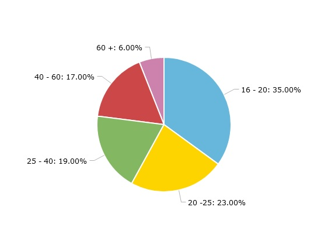
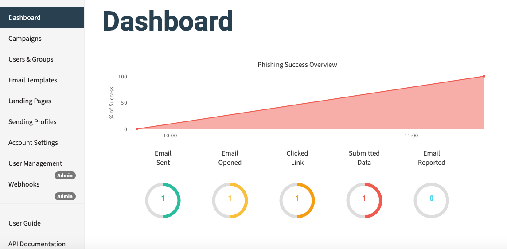
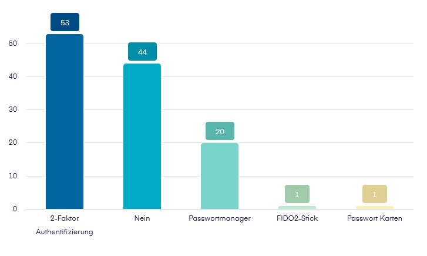

## Postillon

## Warum brauchen wir Passwörter?
Authentifizierung → Prüfung dieses Identitätsnachweises auf seine Echtheit

### Arten Authentifizierung
Wie kann ich mich noch Authentifizierung?

### Wer bin ich? (Biometrie)
- Gesichtserkennung
- Fingerabdruck
- Iris
- Venen
- Handschrift

### Was hab ich?
- Chip Karten
- Schlüssel

### Was weiß ich?
- Passwörter
- Pins

## Anforderungen an ein Passwort
- Länge des Passworts:
  - mind. 12 Zeichen lang
- Entropie erhöhen:
  - Verwendbare Zeichenarten
  - Großbuchstaben
  - Kleinbuchstaben
  - Ziffern
  - Sonderzeichen
  - am besten alle Zeichenarten benutzen
- Länge wichtiger als Entropie

### Wichtig
- Länge wichtiger als Entropie
- Für jeden Dienst ein neues Passwort generieren!

## Umfrage
- Online Umfrage
- Laufzeit eine Woche
- 100 Teilnehmer

### Wie alt sind die Probanden?

### Wie lang sind ihre Passwörter?

### Wie komplex sind ihre Passwörter?

### Verwenden sie Passwörter öfter?

## Angriffe auf Passwörter
Häuigsten Angriffe auf Passwörter sind folgende:
- Passwortlisten
- Bruteforce
- Phishing

### Passwortlisten
- Penetrationstest Betriebsysteme haben Listen
- Bekannteste ist rockyou.txt 
- Sammlungen im Internet:
  - https://github.com/danielmiessler/SecLists
  - Collection #1-5 Total mit 1TB
- Tools zum Generieren von Passwortlisten

### Cupp
Erzeugt Listen mit Informationen über Opfer

### Bruteforce
Bezeichnet das Ausprobieren von Passwörtern

- Hashcat oder John the Ripper (Offline gegen Dateien, Datenbanken)
- Hydra (Online gegen Dienste)

### Phishing
Ist das Abgreifen von Privaten Informationen 
(E-Mail, Kreditkarten Informationen, Passwörtern) 
durch gefälschte E-Mail und Webseiten.

### gophish
Werkzeuge um Phishing Kampagnen zu fahren

### Wissen sie, was Phishing ist?

## Lösungen

## 2FA

### Was ist 2FA?
Bezeichnet den Identitätsnachweis eines Nutzers mittels einer Kombination zweier unterschiedlicher und insbesondere unabhängiger Komponenten.

### Beispiele
//TODO

## Passwotmanager
Ein Safe für alle Fälle

### Was ist das?
Computerprogramm, mit dem sie ihre Passwörter für lokale Anwendungen und Online-Dienste speichern, generieren und verwalten können.

### Test
Tets zweier Bekannter Passwortmanger
- KeepassXC
- Bitwarden

### KeepassXC
- Speichert ein Passwortcontainer auf einem lokalen Datenträger.
- Ein Hauptpasswort
- Generation der Passwörter
- Verlust oder Defekt des Sicherheitsschlüssels kein Zugriff mehr

### Bitwarden
- Cloud-Passwortmanager
- Synchronisiert über Apps und Desktop-Programme

## FIDIO2
Das Passwort der Zukunft!?

### Was ist das?
Ist ein Digitaler Schlüssel auf einem Gerät, häufig ein USB-Stick.
Prinzip basiert auf Asymmetrischer Kryptografie.

### Modi
- Ein-Faktor-Authentifizierung
  - lediglich FIDO2-Stick; kein Passwort nötig, aber vom Dienst abhängig
-Zwei-Faktor-Authentifizierung
  - zusätzlich zum FIDO2-Stick noch PIN, Passwort oder Fingerabdruck

### Vorteil
Identitätsnachweis ohne persönliche Daten zu hinterlassen, durch Verschlüsselung auf der Hardware selbst.

### Nachteil
- Noch nicht von allen Diensten unterstützt
- Geräteverlust
- Beschädigung des Gerätes
- Geräte mind. 20-100€

## Passwort Checker
Sind Passwörter von mir abhanden gekommen?
https://haveibeenpwned.com/
https://sec.hpi.de/ilc/search?lang=de

## Welche Tools werden benutzt?

## Quellen
- https://www.der-postillon.com/2014/04/sicherstes-passwort.html
- https://www.golem.de/news/bitwarden-und-keepassxc-wohin-mit-all-den-passwoertern-2009-151121.html
